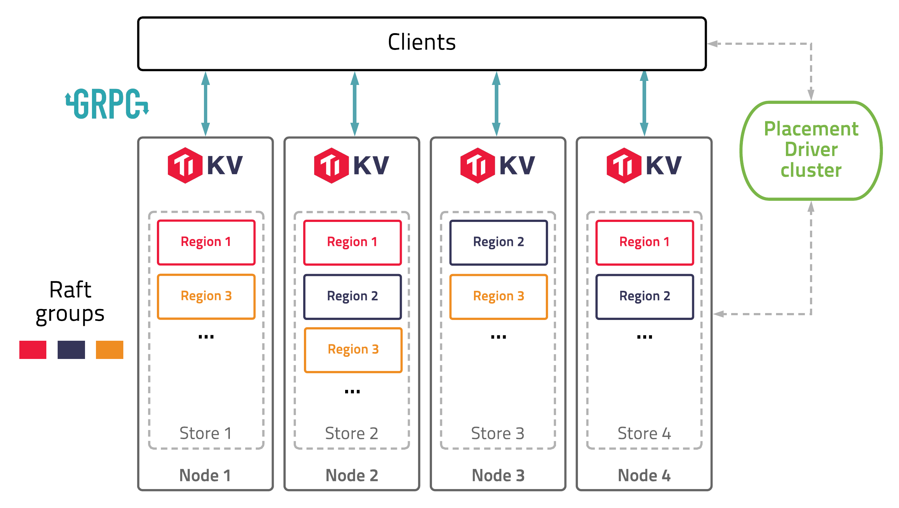

# Understanding TiKV

TiKV is a distributed, transactional key-value database. It is fully ACID compliant and features automatic horizontal scalability, global data consistency, geo-replication, and many other features. It can be used as a building block for other high-level services.

In this chapter, we will introduce everything about the design and implementation of TiKV. We hope that through this chapter, you can develop a deep understanding of TiKV, and build your knowledge of distributed programming.

## History

In the middle of 2015, we decided to build a database which solved MySQL's scaling problems. At that time, the most common way to increase MySQL's scalability was to build a proxy on top of MySQL that distributes the load more efficiently, but we don't think that is the best way.

As far as we knew, proxy-based solutions have following problems:

* Building a proxy on top of the MySQL servers cannot guarantee ACID compliance. Notably, the cross-node transactions are not supported natively.
* It poses great challenges for business flexibility because the users have to worry about the data distribution and design their sharding keys carefully to avoid inefficient queries.
* The high availability and data consistency of MySQL cannot be guaranteed easily based on the traditional Source-Replica replication.

Although building a proxy based on MySQL directly might be easy at the beginning, we still decided to chose another way, a more difficult path — to build a distributed, MySQL compatible database from scratch.

Fortunately, Google met the same problem and had already published some papers to describe how they built [Spanner](http://static.googleusercontent.com/media/research.google.com/en//archive/spanner-osdi2012.pdf) and [F1](https://storage.googleapis.com/pub-tools-public-publication-data/pdf/41344.pdf) to solve it. Spanner is a globally distributed, externally consistent database and F1 is a distributed SQL database based on Spanner. Inspired by Spanner and F1, we knew we could do the same thing. So we started to build TiDB - a stateless MySQL layer like F1. After we released TiDB, we knew we needed an underlying Spanner-like database so we began to develop TiKV.

## Architecture

The diagram below shows the architecture of TiKV:

In this illustration, there are four TiKV instances in the cluster and each instance uses one key-value engine to save data. On top of key-value engine, TiKV uses the [Raft](https://raft.github.io/) consensus algorithm to replicate the data. In practice, we use at least three replicas to keep data safe and consistent, and these replicas form a Raft group.

We use the traditional multiversion concurrency control (MVCC) mechanism and have built a distributed transaction layer above the Raft layer. We also provide a Coprocessor framework so that users can push down their computing logic to the storage layer.

All the network communications are through gRPC so that contributors can develop their own clients easily.

The whole cluster is managed and scheduled by a central service: the Placement Driver (PD).

As you can see, the hierarchy of TiKV is clear and easy to understand, and we will give more detailed explanation later.
