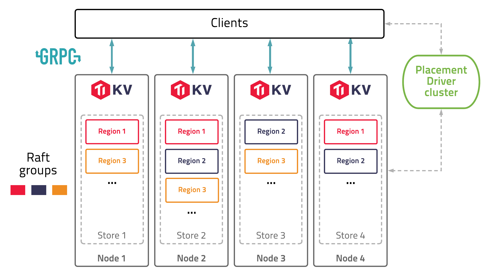

# Region

**Sharding** is one of the most necessary characteristic for a storage system to be scalable (or more specifically, [horizontally scalable](https://en.wikipedia.org/wiki/Scalability)). By breaking data up into partitions, a storage system can distribute data across computers in the cluster, to fully utilize resource of every single node. Meanwhile, migrate partitions to re-balance computing and storage loads when adding nodes to cluster, to gain performance improvement proportional to the increasing of number of nodes, i.e, to archive **Scalability**.

In TiKV, partition is named as `Region`, which is the data unit to be distributed and migrated among TiKV nodes. Region is also the data unit to be replicated by [Raft](https://raft.github.io/), to archive [**High-Availability**](../high-availability/intro.md). A region is likewise a `Raft Group` in Raft algorithm, composed of one or more `Peer`s, while a peer is one of the replica of a partition.

How does TiKV split data into regions? As data element of TiKV is key-value pair, we first decide which keys should be put into a region. In general, there are two approaches:

* Sharding by hash: splitting by hash of keys (e.g. [consistent hashing](https://en.wikipedia.org/wiki/Consistent_hashing)). It is easier to be implemented, as location of keys can be calculated by clients. But it is more difficult to scale up, consistent hashing makes things more complicated, and not efficient to range queries.

* Sharding by range: splitting by range of keys. It is simple, good for scan, easy to scale by splitting and merging, even can switch to sharding by hash easily. But it needs additional management of metadata of partition.

TiKV splits data by key range. Each region contains a continuous range of keys. The [**Placement Driver (PD) server**](https://github.com/tikv/pd) stores the `[start_key, end_key)` and other [metadata](https://github.com/pingcap/kvproto/blob/release-5.2/proto/metapb.proto#L64-L76) of each region, and performs the [scheduling](scheduling.md) of regions.

Then, we determine how many key-value pairs should be stored in one region. The size of a region should not be too small, otherwise the management cost of too many regions would be high. Meanwhile, the size should not be too large, or else region migration would be expensive and time-consuming.

By default, each region is expected to be about 96MB (see [region-split-size](https://docs.pingcap.com/tidb/stable/tikv-configuration-file#region-split-size)) in size. Large regions more than 144MB (see [region-max-size](https://docs.pingcap.com/tidb/stable/tikv-configuration-file#region-max-size)) will be split into two or more regions with 96MB each. Small adjacent regions less than 20MB (see [max-merge-region-size](https://docs.pingcap.com/tidb/stable/pd-configuration-file#max-merge-region-size)) will be merged to one.

Moreover, each region is expected to contain more or less 960000 (see [region-split-keys](https://docs.pingcap.com/tidb/stable/tikv-configuration-file#region-split-keys)) keys, because region size calculation will need to scan all keys in the region. Big regions with more than 1440000 (see [region-max-keys](https://docs.pingcap.com/tidb/stable/tikv-configuration-file#region-max-keys)) keys will be split, while regions with more than 200000 (see [max-merge-region-keys](https://docs.pingcap.com/tidb/stable/pd-configuration-file#max-merge-region-keys)) keys will **NOT** be merged.
